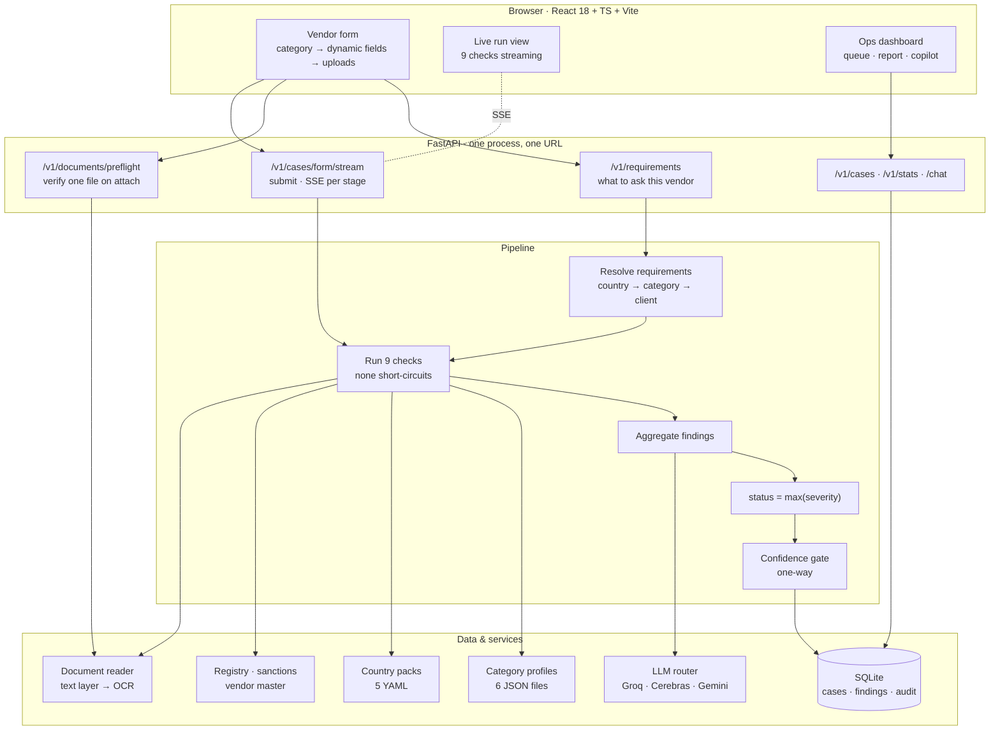
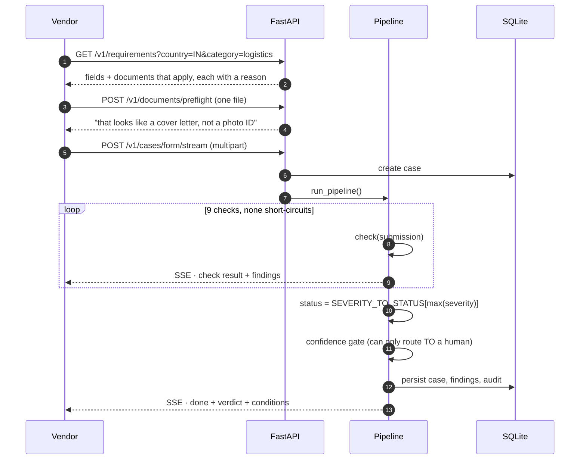
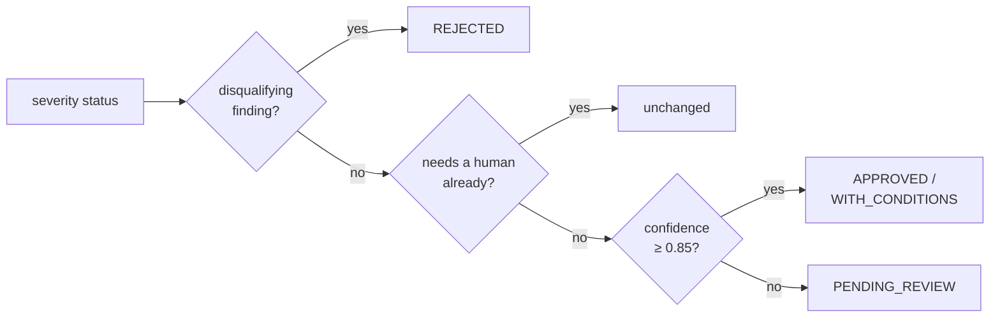
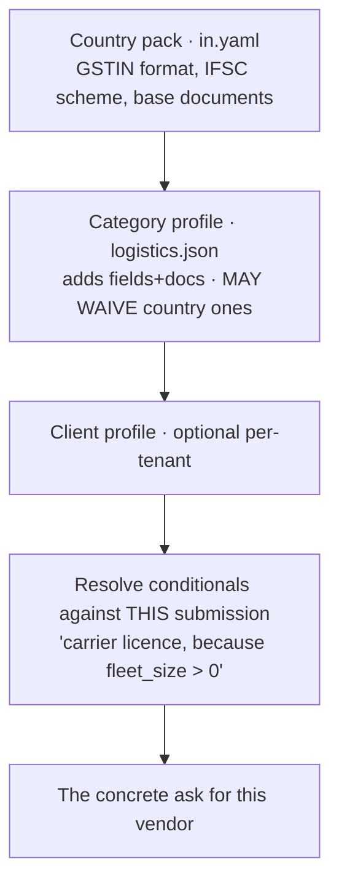
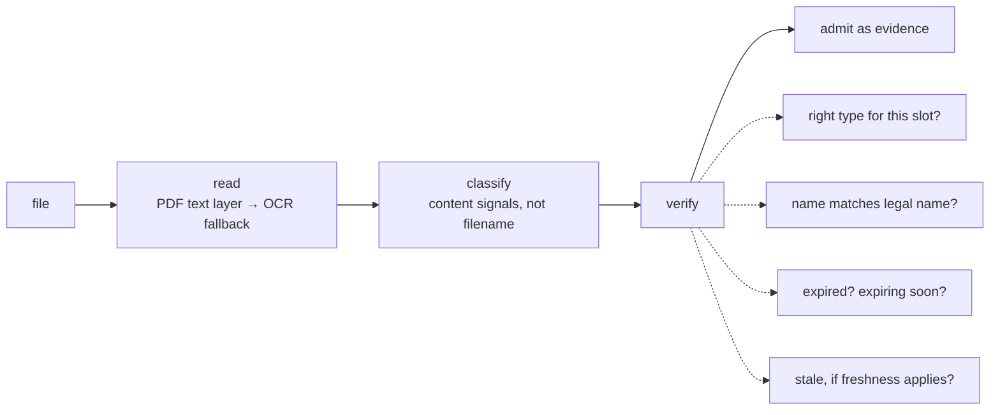
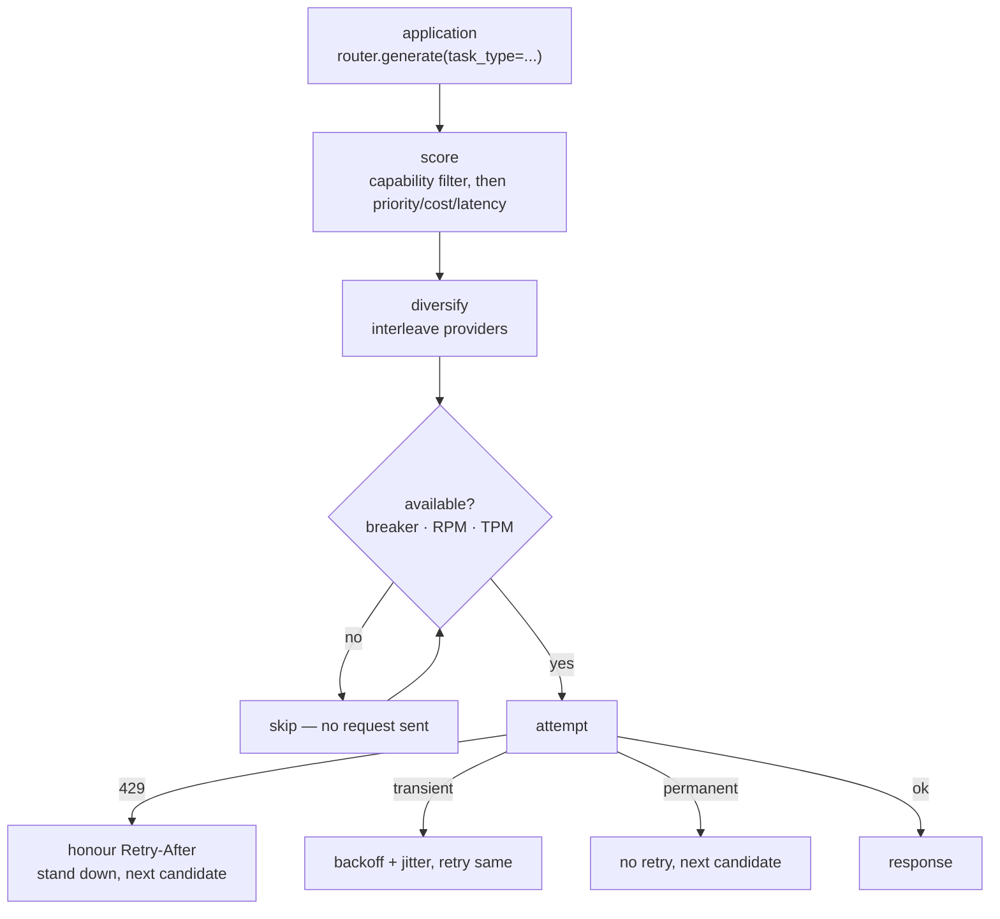
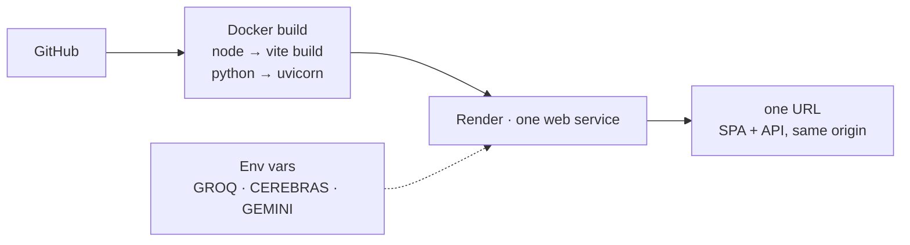

# High-Level Design

A vendor submission goes in. A decided status comes out, with every reason
visible and every decision attributable to a rule.

For component detail see [Architecture.md](Architecture.md); for the LLM layer
see [LLM-Router.md](LLM-Router.md). This is the altitude above both.

---

## 1. The shape of the system



**One process.** FastAPI serves the built SPA and the API from the same origin.
No queue, no broker, no separate frontend deploy, no CORS. Deploys as one
container from one URL — see [§8](#8-deployment).

---

## 2. Request lifecycle



Streaming is not decoration. Onboarding checks take seconds, and a vendor
watching nine *named* checks resolve understands what was verified. A spinner
followed by "rejected" does not build that understanding.

The run also does not depend on the browser staying connected — the pipeline
runs on a background thread pushing into a queue that the response drains. Close
the tab and the case still completes.

---

## 3. The decision model

### Severity determines status. That is the whole rule.

```python
status = SEVERITY_TO_STATUS[max(f.severity for f in findings)]
```

No weighting, no tuned threshold, no score to argue about. Each check decides
how serious its own finding is, at the point where it has the context to judge.

| Severity | Meaning | Status |
|---|---|---|
| `INFO` | Recorded, affects nothing | `APPROVED` |
| `ADVISORY` | Worth knowing, not worth blocking | `APPROVED` |
| `CONDITION` | Fine now, must be resolved later | `APPROVED_WITH_CONDITIONS` |
| `NEEDS_INFO` | The vendor can fix this | `PENDING_INFO` |
| `NEEDS_REVIEW` | A human must judge | `PENDING_REVIEW` |
| `REJECT` | Terminal | `REJECTED` |

`CONDITION` sits between `ADVISORY` and `NEEDS_INFO` **deliberately**. Because
status is `max(severity)`, ordering alone guarantees the invariant: a condition
can never upgrade a case, only hold it or be overtaken by something worse. No
code enforces that — the enum does.

### Confidence is a second, one-way gate



Severity answers *what is wrong*. Confidence answers *how sure are we*, built
from measurable things rather than a vibe:

| Component | Weight | Measures |
|---|---|---|
| Form corroboration | 0.40 | How much of the form documents actually back |
| Document read quality | 0.25 | Crisp text layer vs marginal OCR |
| Classification confidence | 0.15 | How sure each document is what it claims |
| Certainty | 0.20 | Penalty for findings we could not resolve |

**Confidence can only move a case towards a human, never away from one.** A low
score blocks an auto-approval; it can never turn a flagged case into an
approval. Every component is reported, so a reviewer sees *why* it was 0.76.

### Disclosure is gated separately

Two gates, both load-bearing:

1. **Status gate** — vendor-facing text exists only for `PENDING_INFO` and
   `APPROVED_WITH_CONDITIONS`, the two states where the vendor can *act*.
2. **Per-finding gate** — a finding must carry an explicit `vendor_message`.

A rejected vendor learns nothing. Telling someone they matched a sanctions list
is **tipping off** — a criminal offence in several jurisdictions, and it teaches
an adversary exactly which name to change.

---

## 4. The nine checks

None short-circuits. Every check runs on every submission, even after a
rejection is certain.

| # | Check | Kind | Catches |
|---|---|---|---|
| 1 | Completeness | deterministic | Missing fields/documents, resolved per category |
| 2 | Format validation | deterministic | GSTIN/PAN/IFSC/IBAN/ABA shape, IBAN mod-97 |
| 3 | Cross-field consistency | deterministic | IBAN country ≠ claimed country, free-email domains |
| 4 | Document verification | **AI** | Is this the document it claims? Whose name? Expired? |
| 5 | Form vs document | **AI** | Every claim corroborated / contradicted / unevidenced |
| 6 | Client rules | deterministic | Per-tenant custom field rules |
| 7 | Registry verification | deterministic | Does the company exist? Active? Name match? |
| 8 | Denied-party screening | deterministic | Sanctions, two-factor on DOB + nationality |
| 9 | Duplicates & shared banking | deterministic | Same account/registration/tax ID as an existing vendor |

**Why nothing short-circuits.** An invoice pipeline stops at the first decisive
check — correct there, because further work cannot change the answer. Onboarding
is the opposite: stop at the first of four problems and the vendor fixes one
thing, resubmits, and is told about the next. Four round trips, days each. The
entire cost of onboarding is round trips.

The cost is full work on every submission. At dozens of vendors per quarter
that is the right trade; for invoices it would be the wrong one.

**Why 7 of 9 never call a model.** An IBAN checksum does not need an LLM — it
would be slower, non-reproducible and less correct. The two AI checks are never
the sole basis for an approval, and the report renders the two kinds separately,
because *"the checksum failed"* and *"the model thinks this looks like a
resume"* warrant completely different levels of trust.

---

## 5. Generalisation: categories are data

The test of generalisation is not whether the system *handles* many vendor
types — it is whether adding one requires shipping code. Here it does not.



Each layer overrides only what it names. Four tiers: `required`, `conditional`,
`optional`, `na`. Every item carries a `why` shown to the vendor.

**The `when` grammar is deliberately not `eval`.** A small parser supporting
`== != >= <= > <`, `in`, `not in`, `is present`, `is absent`, joined by
`and`/`or`. Anything unparseable evaluates to `false`, so a malformed profile
asks for *less*, never executes something. Profiles are configuration, and
configuration that can run arbitrary code is not configuration.

**The interesting half is removing requirements.** The India pack demands a
GSTIN from every vendor — right for a company, wrong for a freelancer below the
registration threshold who cannot obtain one. Without a waiver that vendor sits
in `PENDING_INFO` forever: they cannot supply what does not exist, and no
reviewer can conjure it.

So a category may waive a country field by declaring it `na`. Two constraints,
both enforced by tests:

- **Only the category layer waives, and only via explicit `na`.** Country
  defaults already mark `tax_id` `optional` for form-layout purposes; honouring
  `optional` here silently dropped the GSTIN requirement for *every* Indian
  vendor. That bug shipped, was caught by
  `test_a_company_in_the_same_country_is_still_asked_for_its_tax_id`, and fixed.
- **Silence inherits.** A category that says nothing gets the country pack
  unchanged.

---

## 6. Document verification



Three details worth stating:

**Classification is by content, not filename.** A file called
`bank_letter.pdf` containing a CV is a CV.

**Freshness applies only to documents attesting to a current state.** A bank
letter proves an account exists *now*; eighteen months later it proves nothing.
A certificate of incorporation records a one-time event and never goes stale —
demanding a "recent" one asks for something that does not exist. Blanket age
limits on every document is a common and irritating onboarding failure.

**Not recognising a document is not the same as it being fine.** Preflight once
green-ticked a cover letter dropped into the photo-ID slot, because the type
check only ran when a slot declared accepted types — and category-added
documents declare none. Unrecognised now always warns.

---

## 7. LLM layer

The application never names a provider. It asks for a **task**; the router
picks a model per request from live rate-limit and health state.



| Provider | Role |
|---|---|
| **Groq** | Fastest tokens/sec. First choice for anything interactive. |
| **Cerebras** | Same open weights, different silicon, **separate quota** — which is what makes it a real fallback rather than a second name for the same failure. |
| **Gemini** | The only one with vision and a genuinely long context, so document work routes there regardless of priority. |

A task type is a **request for capabilities**, not a model alias, and the
mapping lives in YAML. `ops_chat` requires `long_context`, so it skips
Cerebras automatically — whose free tier caps at 8192 tokens. Nobody wrote that
rule; it falls out of the capability filter.

**The decision never depends on a model being up.** `LLM_PROVIDER=offline`
composes the two generated documents from templates; every check, finding,
status and screen is identical. Verified with three deliberately invalid keys:
all nine models fail, all nine breakers open, and all seven prepared scenarios
still reach their expected verdict in 16 seconds.

---

## 8. Deployment



One container. FastAPI serves `frontend/dist` alongside the API, so there is no
separate frontend deploy and no CORS to configure.

An earlier revision had Redis, RQ workers, Postgres and S3. It was strictly
worse *for what this has to do*: it could not be handed to someone as one URL,
and anyone who could not run `docker compose` saw nothing.

The seams that matter remain. Storage is behind an interface, registry and
screening are provider adapters, the LLM client is provider-agnostic, and the
rate limiter has a Redis backend behind a flag. Moving to Postgres and object
storage is configuration at those boundaries, not a rewrite. **What is genuinely
absent is horizontal scale and durable document storage** — stated plainly
rather than implied otherwise.

Keys are read from the environment at call time inside the adapters, so they are
never stored on an object, never in a repr, never in a log line, and a rotated
key needs no restart.

---

## 9. Trade-offs

| Decision | Why | Cost |
|---|---|---|
| Nothing short-circuits | One message to the vendor, full picture for the reviewer | Full work per submission |
| Severity → status, no scoring | Auditable; every verdict traces to one finding | Less expressive than a weighted model |
| Confidence is one-way | A score can block an approval, never create one | Some clean-but-thin cases go to a human |
| `CONDITION` between `ADVISORY` and `NEEDS_INFO` | Ordering alone guarantees the invariant | Renumbering broke magic ints once |
| Categories as JSON | New category ships no code | A schema to keep honest |
| Custom `when` grammar, not `eval` | Config must not execute code | Small parser to maintain |
| 7 deterministic / 2 AI, labelled | Reviewers must know what to trust | Two code paths to explain |
| Offline provider parity | Every result reproducible with no key | Templates maintained alongside prompts |
| SQLite, one process | Deploys as one container, one URL | Not horizontally scalable |
| Streamed checks (SSE) | The vendor sees *what* was verified | Long-lived connections need idle timeouts |

---

## 10. Verification

```
334 tests    pytest tests/ -q
11/11 eval   100% accuracy, 100% recall, 0 false positives
```

| Suite | Covers |
|---|---|
| `test_generalized.py` | Conditions grammar, category resolution, verdicts, copilot, preflight |
| `test_scenarios.py` | Every prepared case reaches its advertised verdict — **and why** |
| `test_llm_router.py` | 429s, Retry-After, fallback, breaker, RPM/TPM, tools, streaming, concurrency |
| `test_end_to_end.py` | Real uvicorn, real multipart uploads, real SSE, all six categories |
| `scripts/evaluate.py` | Labelled fixtures; reports precision and recall |

Tests assert **mechanism, not just status**. `shared-bank-account` reaching
`PENDING_REVIEW` only counts if it got there on the shared-account finding —
otherwise the status passes while the scenario demonstrates nothing.

Several exist to prevent regressions that already happened once: the waiver
leaking globally, tipping off, hardcoded category logic, and a test that passed
with the disclosure gate deleted outright because it read a field that is never
persisted.
