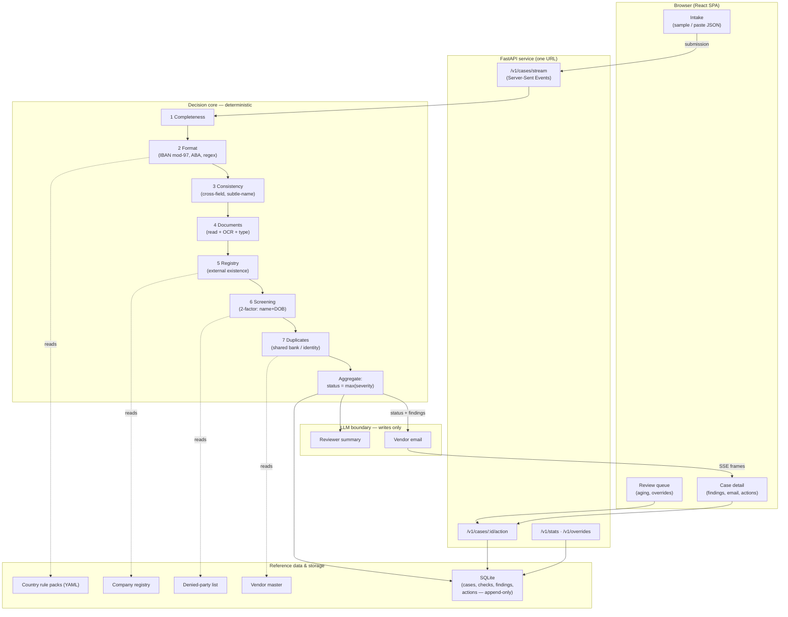

# High-Level Design — Vendor Onboarding

A one-page system view. For the full component-by-component detail see
[Architecture.md](Architecture.md); this is the altitude above it.

---

## What the system does

A vendor submission goes in (form fields + attached documents). Seven
independent checks run against it and against external reference data. Their
findings aggregate into a single status — **approved / pending-info /
pending-review / rejected** — with the full reasoning visible, a drafted vendor
email where the vendor can self-serve, and an append-only audit trail. A human
reviewer can then act on anything not auto-approved.

## System diagram

## The load-bearing design decisions

1. **No check stops early.** Every check runs on every submission, so the
   vendor gets one consolidated message instead of a drip of round trips.

2. **Status is a pure function of severity** — `max(finding.severity)`. No
   weighted score to tune or argue about. Each check owns the severity of its
   own findings.

3. **Severity means *who acts*, not *how bad*.** Vendor-fixable → the vendor;
   judgement call → an internal reviewer; terminal → rejected. This is what
   routes a case correctly.

4. **The LLM never decides.** It writes the vendor email and the reviewer
   summary *after* the decision is fixed. Everything that affects the outcome
   is deterministic and reproducible.

5. **Internal consistency ≠ legitimacy.** Six checks confirm the submission
   agrees with itself; the registry check confirms the company exists against a
   source the vendor doesn't control.

6. **Disclosure is a hard gate.** A vendor email is generated *only* for
   pending-info — never for a case under review or rejected, so a fraudster is
   never told which control caught them.

## Data flow, in one line

`submission → 7 deterministic checks (reading YAML rules + registry + lists) → aggregate to status → LLM writes email & summary → persist append-only → stream to UI → reviewer acts → audit log`

## External interfaces

| Interface | In | Out |
|---|---|---|
| Intake (UI or `POST /v1/cases/stream`) | vendor submission JSON + documents | SSE stream of per-check results, then final case |
| Reviewer action (`POST /v1/cases/:id/action`) | approve / reject / request-info / resolve | updated status + audit entry |
| Reference data | country rule packs, company registry, denied-party list, vendor master | consumed by checks |
| LLM (optional) | finished decision + findings | vendor email, reviewer summary |

## Deployment shape

One container: the React app is built and served by the same FastAPI process,
so the whole product is a **single URL**. Runs fully offline (no API key) by
default; a model can be plugged in via one environment variable. See
[../DEPLOY.md](../DEPLOY.md).

## Quality evidence

Two evaluation harnesses report auto-approve precision, fraud/compliance
recall, and false-positive rate — one on the 11 curated golden cases, one on
250 generated cases including *plausible* fraud. A calibration script shows why
each threshold sits where it does. 95 automated tests.
